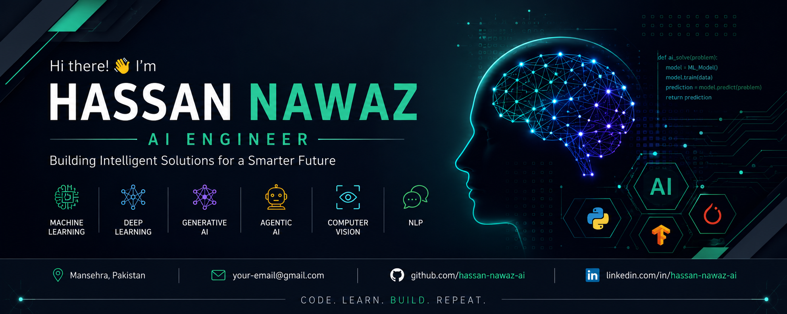

  

# Hi there 👋, I'm Hassan Nawaz

## 🤖 AI Engineer | BS Artificial Intelligence Student

I am passionate about Artificial Intelligence and enjoy building intelligent applications using Machine Learning and Deep Learning.

---

## 🚀 About Me

🎓 BS Artificial Intelligence Student

💻 AI Engineer

🌱 Currently Learning:
- Machine Learning
- Deep Learning
- Generative AI
- Agentic AI
- PyTorch
- TensorFlow

🎯 Goal:
Become a world-class AI Engineer and contribute to Open Source AI projects.

---

## 🛠️ Languages & Tools

- Python
- C++
- Git
- GitHub
- VS Code
- Jupyter Notebook
- PyTorch
- TensorFlow
- OpenCV
- NumPy
- Pandas
- Scikit-learn

---

## 📂 Featured Projects

- 🤖 AI Chatbot
- 🎓 Smart Attendance System
- 😊 Face Recognition System
- 📊 Machine Learning Projects
- 🧠 Deep Learning Projects

---

## 📫 Connect With Me

GitHub: https://github.com/hassan-nawaz-ai

Location: Mansehra, Pakistan

---

⭐ Thanks for visiting my profile!
